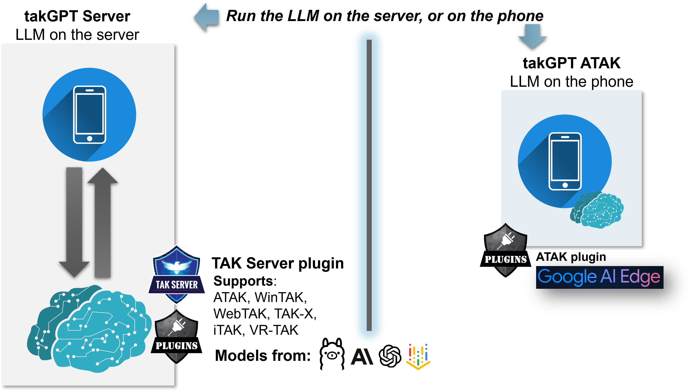

### TAK GPT
TAK GPT refers to two related projects, both of which expose Large Language Model (LLM) based bots/agents to Team Awareness Kit (TAK) users. One project does this as an ATAK plugin, and runs the models directly on the phone. The other project, which this repo represents, runs as a TAK Server plugin, and can run the models at the TAK Server or at any network reachable location (e.g., the cloud).

### Motivation

### Design
The TAK GPT server plugin, like all TAK Server plugins, is built as a Java JAR file that is placed in the lib directory of your TAK Server (e.g., /opt/tak/lib). Once there it is managed by TAK Server's Plugin Manager micro service, and can be controlled via the TAK Server web admin user interface on the Plugins page. As a TAK Server plugin, TAK Server manages its life cycle - so you do not need to explicitly start TAK GPT. It interfaces with TAK Server via the plugin API, and so no external network connections are made and no certificates / key material needs to be provisioned or configured to talk to TAK.

TAK GPT itself is not an LLM model, and does not provide any LLM models. Rather, it is a tool for easily exposing models to TAK users as agents / bots that show up in TAK's standard contacts view (in ATAK, WinTAK, TAK-X WebTAK, iTAK, VR-TAK, etc.). Users then chat with these agents like they would any other (human) TAK contact.

TAK GPT supports multiple ways to interact with LLMs, including both local (e.g., on the same device) models and those running in the cloud or other network-reachable locations. The list of currently supported LLM hosting frameworks are:
* Ollama (good for running local / offline models)
* OpenAI - including any OpenAI API compatible services such as Azure's model hosting, or OpenRouter
* Anthropic
* Google's Vertex AI (untested beta support)

TAK GPT also supports Google's Agent Development Kit (ADK) for agent building, which under the hood can talk to Ollama, Vertex AI, or other LangChain compatible hosting providers. Currently the agent capabilities provide the ability to affect basic TAK actions (e.g., add a marker to the map), but this set will be growing in the very near term to include a wide array of TAK actions, plus interactions with external systems such as cameras, radars, and UAS.

### Usage

To use TAK GPT, you need to build, configure and deploy:

#### Build

From the root of the project:

./gradlew shadowJar (Linux)
or
./gradlew.bat shadowJar (Windows)

#### Configure

All TAK Server plugins have an accompanying yaml configuration file. If not provided, a blank one is generated automatically for you when TAK Server is started with a plugin deployed. For TAK GPT this config file details which models/agents/bots are loaded, how they appear (under which callsign, at which location), and which groups have access to them. For each bot/agent exposed, there are a set of core configuration options. Additional options are provider specific (e.g., may only be relevant to models hosted by Azure, or by Ollama). The configuration parameters are listed in the table below, and an example configuration file can be found [here](conf/plugins/tak.server.plugins.TAKChatBotBase.yaml).

| Applicable to | Property Name | Description | Required |
| ------------- | ------------- | ----------- | -------- |
| All | modelType | a selection from the following values: ollama, anthropic, openai, google-agent | Yes |
| All | botName | The name (callsign) the bot will show up as in the TAK contacts list | Yes |
| All | groups | The list of groups that this bot should be exposed to | Yes |
| All | latitude | That latitude that the bot should appear at | No (default: 0) |
| All | longitude | The longitude that the bot should appear at | No (default: 0) |
| All | systemPrompt | A system prompt for the LLM | No |
| All | systemPromptFilePath | A file path to a system prompt for the LLM - will load as a text file | No |
| All | modelName | Name of the model to load from the LLM hosting provider | Yes |
| Anthropic| apiKey | The API key to use | Yes |
| Anthropic| baseURL | The API key to use | Yes |
| Google Agent | modelHost | The host to access the model at | Yes |
| Google Agent | modelPort | The port to access the model on | Yes |
| Ollama | modelHost | The host to access the model at | Yes |
| Ollama | modelPort | The port to access the model on | Yes |
| Ollama | ragDirectory | A directory to load txt and PDF files from for use with Retrieval Augmented Generation (RAG) | No |
| Ollama | embeddingModel | The embedding model to use, if employing RAG | No |
| Vertex AI | projectID | The Google project ID| Yes |
| Vertex AI | locationID | The Google location ID for the model | Yes |
| Vertex AI | modelName | The name of the model to load | Yes |
| Vertex AI | serviceAccountFileLocation | | Yes |

#### Deploy

To deploy TAK GPT:
* Place the TAK GPT jar in /opt/tak/lib
* Place your configuration file (must be named tak.server.plugins.TAKChatBotBase.yaml) in /opt/tak/conf/plugins/
* Restart TAK Server, or at least the plugin micro service

### Extension

To extend TAK GPT you can
* Add new configuration parameters and capabilities to any of the provider classes in tak.server.plugins.agent.*
* Add new model hosting providers by introducing a new class that implements LLMChatManager (simple single method interface) and updating TAKChatBotBase to instantiate new instances of your new type when configured to do so